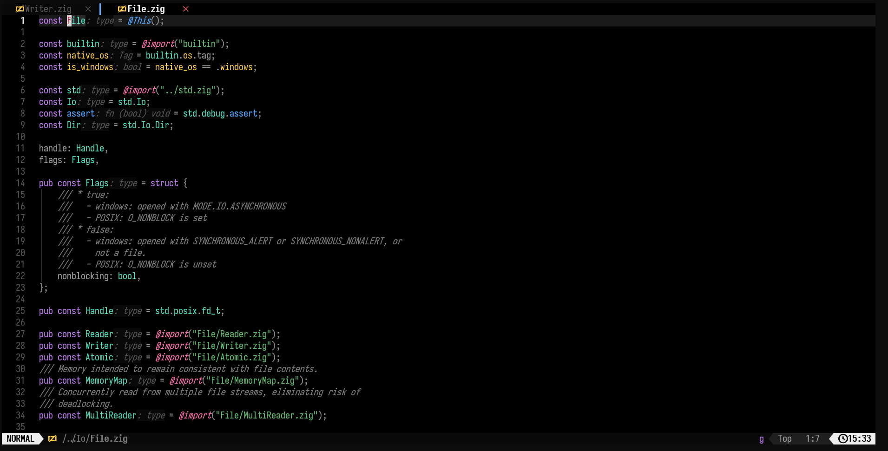

# vercel.nvim

A dark Neovim colorscheme built on Vercel's [Geist](https://vercel.com/geist/introduction) design
system: pure black background, neutral gray body text, and accent colors reserved for the few
tokens that actually need them.

**[中文文档](README.zh-CN.md)**

Around 710 highlight groups covering the editor UI, legacy Vim syntax groups, Treesitter captures,
LSP diagnostics and semantic tokens, and roughly 30 common plugins.

Requires Neovim 0.9+ and a terminal with true color support (`termguicolors`).

> Unofficial. This theme borrows the Geist color scale; it is not affiliated with or endorsed by Vercel.

## Preview



*Zig with ZLS inlay hints, bufferline, and lualine.*

Open [`preview.html`](preview.html) in a browser for the full palette alongside a mock editor
window.

```tsx
// Fetch deployments and sort by creation time
import { cache } from "react";
import { Deployment } from "@/lib/types";

const LIMIT = 50;

export async function listDeployments(
  projectId: string,
  limit: number = LIMIT,
): Promise<Deployment[]> {
  const rows = await query(`SELECT * FROM deployments`, { projectId });
  if (!rows.length) return [];

  return rows
    .sort((a, b) => b.createdAt - a.createdAt)
    .slice(0, limit);
}
```

## Design

Vercel's interface is defined by a pure black canvas, large areas of neutral gray, and accent color
used only where it guides the eye. The theme follows three rules derived from that:

1. **Four background layers, nothing more.** `#000000` for the buffer, `#0a0a0a` for floats and
   sidebars, `#1a1a1a` for the cursor line, `#292929` for borders. Depth comes from lightness
   alone — no shadows, no decorative separators.
2. **Body text stays neutral.** Variables, properties, members, and punctuation use the gray scale
   (`#ededed` / `#a1a1a1` / `#8f8f8f`). Leaving them uncolored is what gives the colored tokens
   their weight.
3. **Five accent roles.** Keywords are purple, functions blue, strings green, literals amber, types
   cyan. Pink marks control-flow turning points — `import`, `return`, escape sequences, exceptions.
   Everything else falls back to the gray scale.

### Palette

| Role | Hex | Contrast on `#000000` |
| --- | --- | --- |
| Body text | `#ededed` | 17.9:1 |
| Secondary text, operators | `#a1a1a1` | 8.1:1 |
| Punctuation, delimiters | `#8f8f8f` | 6.5:1 |
| Comments | `#7d7d7d` | 5.1:1 |
| Keywords | `#bf7af0` | 7.3:1 |
| Functions | `#52a8ff` | 8.4:1 |
| Strings | `#62c073` | 9.3:1 |
| Numbers, constants | `#ffcb47` | 13.9:1 |
| Types | `#50e3c2` | 13.1:1 |
| Import, return, escapes | `#ff6fae` | 8.1:1 |
| Errors | `#ff6369` | 7.2:1 |

Every syntax color clears 7:1 against the background (WCAG AAA for body text); comments sit at
5.1:1 (AA).

## Installation

### lazy.nvim

```lua
{
  "idontdebug/vercel.nvim",
  lazy = false,
  priority = 1000,
  opts = {},
  config = function(_, opts)
    require("vercel").setup(opts)
    vim.cmd.colorscheme("vercel")
  end,
}
```

### packer.nvim

```lua
use({
  "idontdebug/vercel.nvim",
  config = function()
    require("vercel").setup({})
    vim.cmd.colorscheme("vercel")
  end,
})
```

### vim.pack (Neovim 0.12+)

```lua
vim.pack.add({ "https://github.com/idontdebug/vercel.nvim" })
vim.cmd.colorscheme("vercel")
```

### Without a plugin manager

```bash
git clone https://github.com/idontdebug/vercel.nvim \
  ~/.local/share/nvim/site/pack/themes/start/vercel.nvim
```

On Windows the target is `%LOCALAPPDATA%\nvim-data\site\pack\themes\start\vercel.nvim`. Then:

```lua
vim.cmd.colorscheme("vercel")
```

### Variants

| Command | Background |
| --- | --- |
| `:colorscheme vercel` | `#000000` |
| `:colorscheme vercel-soft` | `#0a0a0a` |

## Configuration

`setup()` only stores options; they take effect when the colorscheme loads. Calling `setup()` is
optional — the defaults below apply either way.

```lua
require("vercel").setup({
  background = "black",      -- "black" = #000000, "soft" = #0a0a0a
  transparent = false,       -- let the terminal background show through
  terminal_colors = true,    -- set g:terminal_color_0..15
  dim_inactive = false,      -- darker background for unfocused windows
  float_border = "single",   -- "single" colors float borders, "none" blends them into the background
  sidebars = {               -- windows with these filetypes get the #0a0a0a background
    "qf", "help", "NvimTree", "neo-tree", "Trouble", "trouble",
    "lazy", "mason", "fugitive",
  },
  styles = {
    comments   = { italic = true },
    keywords   = { italic = false },
    functions  = {},
    variables  = {},
    types      = {},
    strings    = {},
    booleans   = { bold = true },
    parameters = { italic = true },
  },
  on_colors = nil,           -- function(colors) end
  on_highlights = nil,       -- function(highlights, colors) end
})
```

### Changing colors

`on_colors` runs before the highlight groups are built, so a single change propagates to every
group that references that color:

```lua
require("vercel").setup({
  on_colors = function(c)
    c.comment = "#6b6b6b"   -- dimmer comments
    c.purple = c.blue       -- keywords in blue instead
  end,
})
```

`on_highlights` runs after every group has been generated, for overriding individual groups:

```lua
require("vercel").setup({
  on_highlights = function(hl, c)
    hl.CursorLine = { bg = "#141414" }
    hl["@keyword.return"] = { fg = c.pink, bold = true }
    hl.WinSeparator = { fg = c.gray_300 }
  end,
})
```

Besides the semantic names (`fg`, `comment`, `blue`, …), `c` carries the raw Geist scale as
`c.gray_100` through `c.gray_1000`, and the complete source palette under `c.geist`.

Both hooks receive plain tables, so you can also read the palette without loading the theme:

```lua
local colors = require("vercel").palette()
```

### Transparent background

```lua
require("vercel").setup({ transparent = true })
```

`Normal`, `NormalFloat`, `SignColumn` and friends get `bg = "NONE"`. Popup menus and completion
windows keep a solid background — otherwise their text would sit on top of whatever is underneath.

## lualine

The theme file lives at `lua/lualine/themes/vercel.lua` and is picked up automatically:

```lua
require("lualine").setup({
  options = { theme = "vercel" },
})
```

Mode accents: normal white, insert blue, visual purple, replace red, command amber, terminal green.

## Supported plugins

telescope.nvim, fzf-lua, nvim-cmp, blink.cmp, gitsigns.nvim, neo-tree.nvim, nvim-tree.lua,
oil.nvim, mini.nvim (files / statusline / tabline / indentscope / pick / cursorword), snacks.nvim,
bufferline.nvim, indent-blankline.nvim, which-key.nvim, trouble.nvim, nvim-notify, noice.nvim,
lazy.nvim, mason.nvim, flash.nvim, leap.nvim, hop.nvim, vim-illuminate, nvim-navic, barbecue,
dropbar, nvim-treesitter-context, rainbow-delimiters, todo-comments.nvim, nvim-dap and dap-ui,
fidget.nvim, alpha-nvim, dashboard-nvim, aerial.nvim, diffview.nvim, render-markdown.nvim,
headlines.nvim, copilot.lua, codeium.

Anything not listed falls back to the standard groups (`Normal`, `Pmenu`, `Comment`, …) and
usually looks correct anyway.

## Layout

```
vercel.nvim/
├── colors/
│   ├── vercel.lua              -- :colorscheme vercel
│   └── vercel-soft.lua         -- :colorscheme vercel-soft
└── lua/
    ├── lualine/themes/vercel.lua
    └── vercel/
        ├── init.lua            -- setup / load / terminal colors / sidebars
        ├── config.lua          -- defaults
        ├── palette.lua         -- Geist scale and semantic colors
        ├── util.lua            -- color blending, style merging, applying highlights
        └── groups/
            ├── init.lua        -- collects the modules, runs on_highlights
            ├── editor.lua      -- editor UI
            ├── syntax.lua      -- legacy Vim syntax groups
            ├── treesitter.lua  -- @ Treesitter captures
            ├── lsp.lua         -- diagnostics and LSP semantic tokens
            └── plugins.lua     -- plugin groups
```

## Inspecting colors

```vim
:Inspect
:highlight @function
```

`:Inspect` reports the Treesitter capture, LSP token, and syntax group active under the cursor.
That is the group name to target in `on_highlights`.

## License

MIT — see [LICENSE](LICENSE).

Color values are taken from Vercel's Geist design system.
